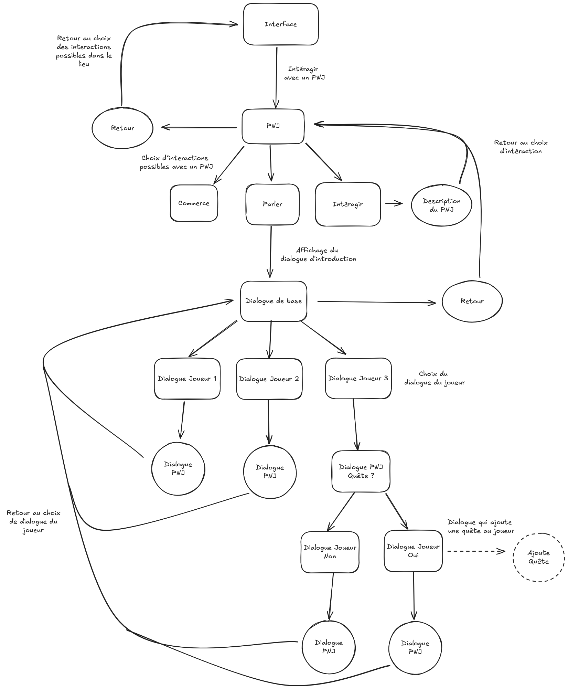
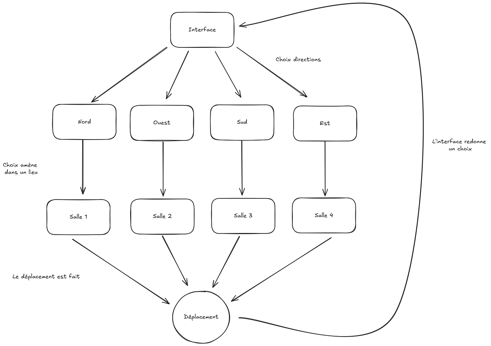
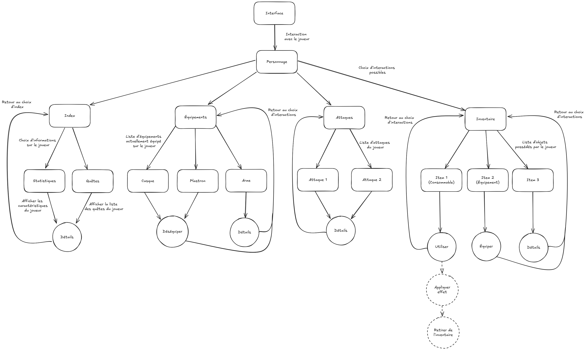
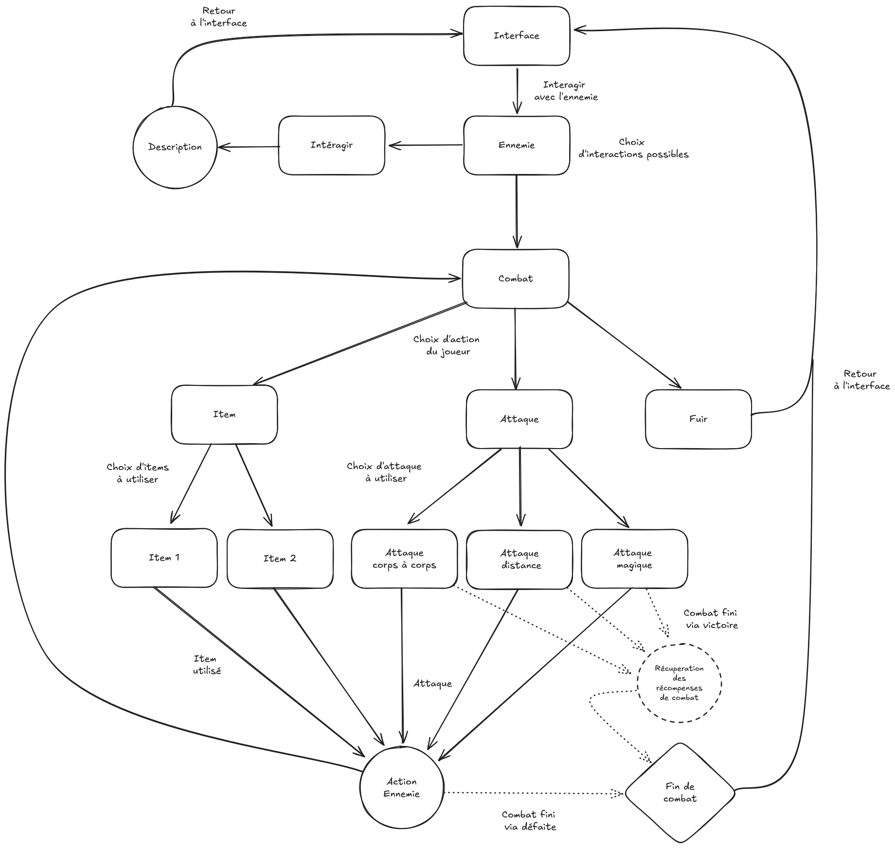

# Tâches

## Quête

### Ce qu’il faut faire :
- Implémenter un système de quêtes permettant :
  - L’ajout de quêtes à un joueur.
  - La détection automatique de la fin de quête selon différents types de conditions.
  - L’attribution de récompenses au joueur une fois la quête terminée.
  - La progression logique vers la quête suivante.

### Ce qui a été fait :
- Ajout des fonctions de **fin de quête** (gestion des récompenses + transition vers la quête suivante).
- Ajout des fonctions d’**ajout de quête** via la variable `ajout_quete`.
- Implémentation de **l’inventaire des personnages** pour pouvoir y ajouter des récompenses (`inventaire : {objet_id : String, Nb_objets: int}`).
- **Fusion de la structure des quêtes et des dialogues** dans le JSON.
- Modifications du fichier JSON :
  - Formatage de l’inventaire.
  - Ajout d’un **attribut `statut`** pour suivre l’état de chaque quête (non commencée, en cours, finie).
  - Ajout d’un **attribut `fin_de_quete`** avec 4 conditions possibles (`Interaction`, `Dialogue`, `Combat`, `Obtention`).
  - Possibilité de **liens multiples** entre dialogues/quêtes via `quetes_suivantes`.
  - Ajout de l’attribut `ajout_quete` pour permettre l’activation de nouvelles quêtes via dialogues.

### Ce qu’il reste à faire :
- Optimiser le système de **détection de la fin de quête**, éviter de parcourir toutes les quêtes du joueur à chaque interaction.

## PNJ

Ce qu'il faut faire : 

Ce qui à été fait :

Ce qu'il reste à faire:

## Déplacement

Ce qu'il faut faire : 

Ce qui à été fait :

Ce qu'il reste à faire:

## Équipements et Joueur

Ce qu'il faut faire : 
 
Ce qui à été fait :

Ce qu'il reste à faire:

## Combat

Ce qu'il faut faire : 

Ce qui à été fait :

Ce qu'il reste à faire:
